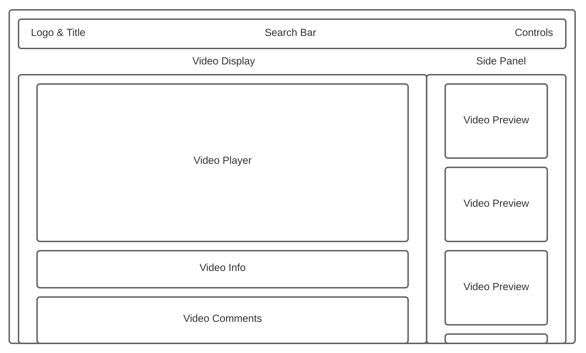

<div align="center">
    
</div>

## Background and Overview 
[ZooTube](https://zootube.herokuapp.com/#/) is a social media website that allows users to upload and share videos with one another. Users can like, dislike, comment on, and search for videos within the site, creating an immersive and social feel that promotes ongoing user engagement. Finally, users can edit and delete their own videos, likes, and comments, achieving a robust CRUD functionality across several key features. Give it a try and see for yourself!

## Architecture and Technologies
* Ruby on Rails
* Postgres
* AWS
* JavaScript
* React/Redux
* HTML
* CSS

## Wireframes




## Video Upload
Once signed in, users can access a video upload form with a clear, minimalist layout.


The form's video and image boxes use Dropzone, a React hook that allows for HTML5-compliant drag-and-drop functionality. Meanwhile, the default click option to find and select a video/image for upload has been preserved, allowing users some flexibility in how they choose to complete the form. Some basic CSS styling provides visual cues indicating to the user that they can interact with these boxes and, later, that a video/image has successfully uploaded. If there are any problems with a submission attempt, error messages will display at the bottom of the form.

## Search
<div align="center">
    
</div>

A search field within the navbar allows users and guests of the site to quickly search for videos. The integration of search functionality was possible with only minor tweaks to the video controller's index action. When a search is made, whatever text is in the input field is passed into the index action as an argument. From there, Rails will fire an SQL query to select all videos whose lowercased titles include the lowercased query. This helps get around issues with differing capitalization between video titles and search requests. For example, if a user simply searched for 'penguin', or if they accidentally had their caps-lock on, their search results would still include a video with the title 'Penguin Party'. 

```ruby
def index(query = "")
    query = params['query'] || ""
    @videos = Video.where("lower(videos.title) like '%#{query.downcase}%'")
    render :index
end
```

By default, when no query is present, the controller's index action will behave as expected and simply serve up all videos (e.g., when navigating to the video index page).

## Upcoming Features
The following is a list of additional features I would like to add to the site in the future:
* A queue feature that users can add videos to, allowing them to better manage their viewing experience
* Liking, disliking, and replying to comments
* Dynamic search functionality that allows users to search by video length, upload date, view count, and more